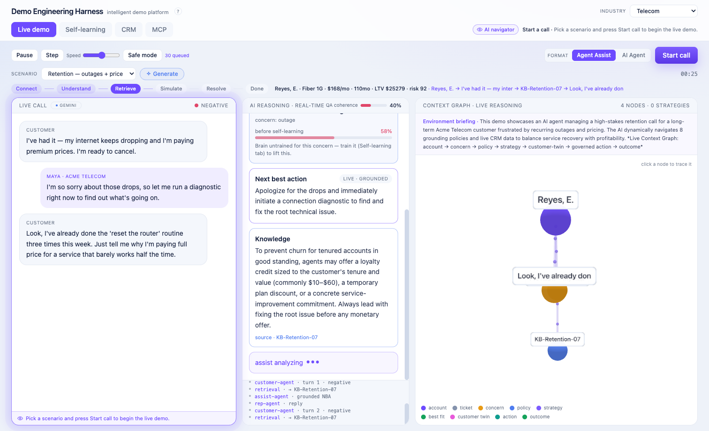
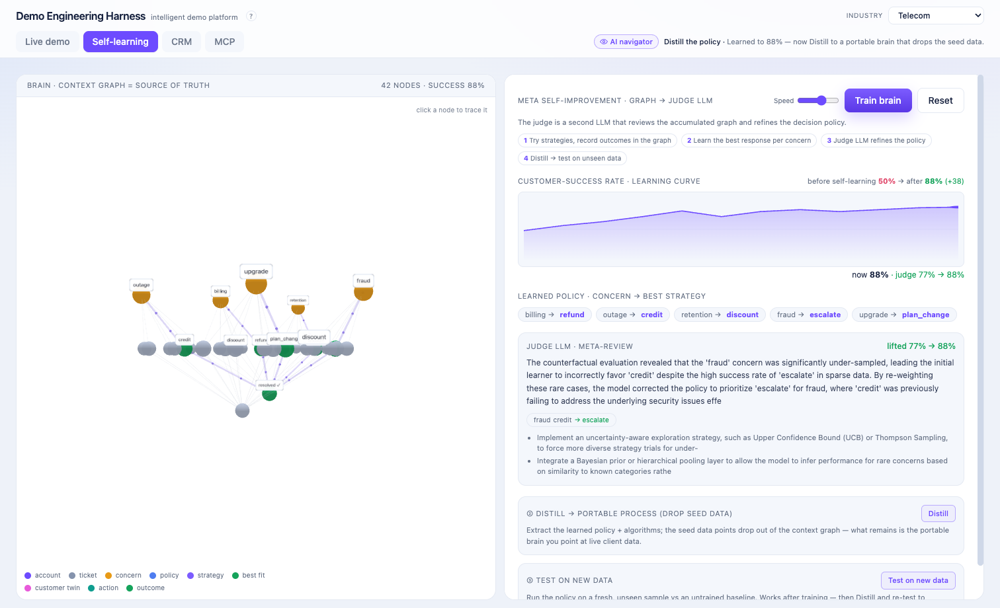

# Demo Engineering Harness

> An AI-managed, self-improving customer-service demo platform. **One link** → a live, unscripted
> contact-center call you can watch reason in real time, plus a "brain" that teaches itself the best
> policy per concern — across five industries, with a hard daily cost cap so the public link is safe.

<p align="center">
  <a href="https://forge.5.78.192.178.sslip.io/demo"><b>▶ Live demo</b></a> &nbsp;·&nbsp;
  Next.js 14 · SSE · Gemini &nbsp;·&nbsp; <i>every output generated live — nothing scripted</i>
</p>

<p align="center">
  <a href="https://forge.5.78.192.178.sslip.io/demo">
    
  </a>
</p>

Most product demos are gated, scripted, output-only, and reasoning-opaque. This is the opposite — a
single shareable link where you watch an AI handle a live call end to end, **see why** it chose each
move, watch the system **teach itself** the best response, and read the governed, audited result.

## Highlights

- **Live, unscripted calls.** A real contact-center conversation streams in: the agent reasons, grounds
  each reply in a knowledge base, simulates candidate strategies against a digital-twin of the customer,
  and takes a **governed, audited** action. A 3D context graph lights up as it reasons. Pausable,
  steppable, replayable — with a real-time **QA-coherence meter**.
- **A brain that learns (and proves it).** A policy learner accumulates outcome evidence, an offline
  **judge** corrects what the live loop under-sampled, then the policy is **distilled** and **tested on
  unseen data** vs. an untrained baseline. The before→after lift is measured fresh every run.
- **The loop is closed.** The live agent **consults** the learned brain ("recommends *credit* — 88% over
  139 cases") and **feeds each outcome back** into the graph. Train it → the live demo measurably improves.
- **Five industries, one click.** Telecom, fintech, travel, retail, healthcare — each with its own CRM,
  knowledge base, scenarios, and independently-trained brain.
- **An MCP control plane.** Drive and manage the whole platform from any MCP client; every change is audited.
- **Safe to host publicly.** A hard daily cost cap + per-IP rate limit + a deterministic Safe-mode replay
  mean a shared link can never run up a bill (a full run ≈ $0.001–0.002).

## The self-learning loop

<p align="center">
  
</p>

It's a **contextual bandit that learns a decision policy, plus an offline counterfactual evaluator**:

1. **Context graph = memory.** Nodes are *concerns* (billing, outage, fraud…) and *strategies* (refund,
   credit, escalate…); weighted edges record observed outcomes. It's the source of truth + audit trail.
2. **Online learning (ε-greedy).** Cases stream in (some concerns rare); the agent explores or exploits,
   observes win/lose, records it; exploration decays. After each round it re-derives the confidence-
   weighted best strategy per concern — the climbing curve.
3. **The judge (offline policy evaluation).** The online loop under-samples rare, high-stakes concerns
   (e.g. fraud) and can lock onto a lucky pick. The judge re-tests **every** strategy with fresh
   counterfactual rollouts, finds the true optimum, and corrects the policy — the reliable lift. An LLM
   then writes the rationale and proposes algorithmic upgrades.
4. **Distill → test.** Drop the raw cases, keep the rules (a sufficient statistic) = the portable brain;
   run it on unseen data vs. a random baseline to prove it generalizes.

> Example (telecom): cold ≈ 50% → online training ≈ 80%, but fraud is rare so it may pick "refund"; the
> judge runs 600 counterfactual fraud cases/strategy, sees `escalate` 90% vs `refund` 55%, switches the
> policy, +7% overall. Distilled brain then scores **88% on unseen data vs. 50% baseline**.

## Run locally

```bash
git clone https://github.com/tyejcoleman/demo-engineering-harness
cd demo-engineering-harness
npm install
cp .env.example .env.local          # add your GEMINI_API_KEY (aistudio.google.com/app/apikey)
npm run dev                          # http://localhost:5178/demo
```

```bash
npm run build && npm start           # production build
npm run mcp                          # MCP server (drive the platform from an MCP client)
```

## Architecture

Framework-agnostic ES modules in `core/*.mjs` are imported by **both** the Next.js app and the node
probes, so the code that ships is the code that's tested. UI lives in `app/` and `components/`.

- `core/demo.mjs` — the live call engine (SSE): reasoning, retrieval, twin-simulation, governance, QA.
- `core/brain.mjs` — per-industry self-learning: training, the judge (counterfactual evaluation), distill,
  validate, and the live↔brain loop.
- `core/profiles.mjs` / `core/crm.mjs` — the five industries and their simulated source-of-truth data.
- `core/llm.mjs` · `core/usage.mjs` · `core/ratelimit.mjs` — model tiering, the cost meter + daily cap,
  the throttle. `core/governance.mjs` · `core/audit.mjs` — governed actions + audit trail.
- `app/api/*` — SSE/JSON routes. `mcp/server.mjs` — the platform exposed as MCP tools.

## Configuration

| Variable | Default | Purpose |
|---|---|---|
| `GEMINI_API_KEY` | — | Gemini key for the live runtime (or `GOOGLE_API_KEY`) |
| `DEMO_DAILY_USD_CAP` | `5` | Hard daily spend cap (USD, estimated) |
| `FORGE_FAST_MODEL` / `FORGE_ACCURATE_MODEL` | gemini-3.1-flash-lite / gemini-3.5-flash | Model tiers |

## Self-hosting

It's a standard Next.js app — `npm run build && npm start` behind any reverse proxy, or containerize
with the included `Dockerfile`. Bring your own `GEMINI_API_KEY`; the daily cost cap keeps a public
instance safe.

## License

MIT — see [LICENSE](LICENSE). © 2026 Tye Coleman.
